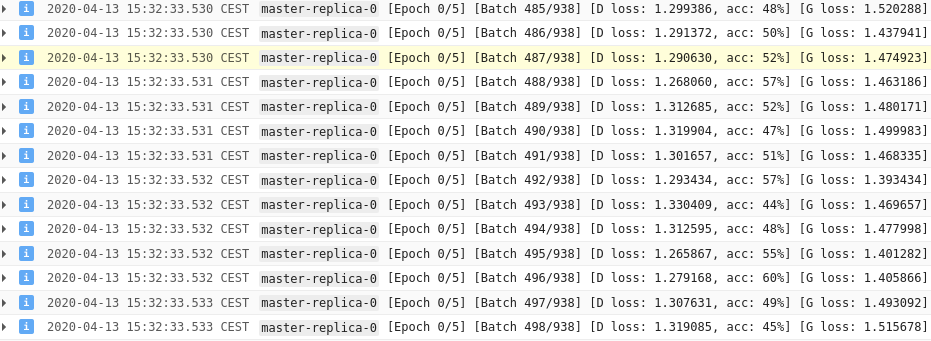
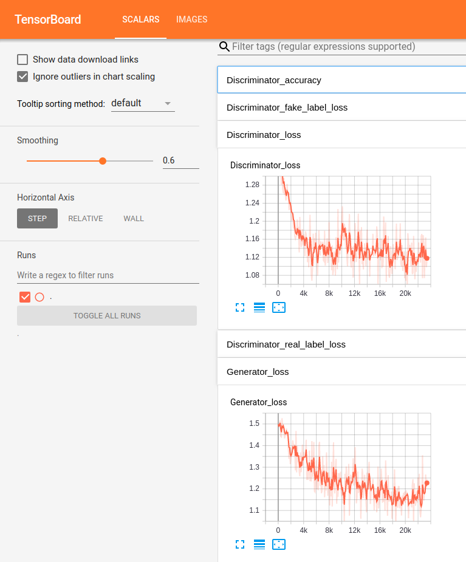
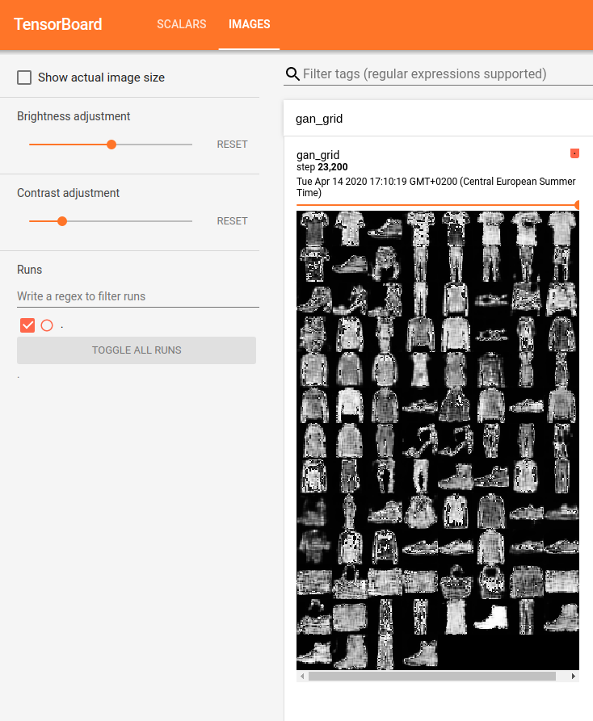

# Google AI Platform with PyTorch tutorial

This repo is a walkthrough on how to send Pytorch training jobs to Google Cloud using
your command line.

This particular example uses an ACGAN with the FashionMNISt
dataset (code adapted from [this
source](https://github.com/clvrai/ACGAN-PyTorch/blob/master/main.py)).

## Set up

### Requirements

- You have an account on [Google Cloud
Platform](https://console.cloud.google.com/home).
- You have [installed the Google Cloud SDK client](https://cloud.google.com/sdk/install).
- You are [logged in your GCloud account](https://cloud.google.com/sdk/gcloud/reference/auth/login).
- You have set your Google Cloud project as default in your client:

```shell script
gcloud config set project <your-project-name>
```

- Make sure Google AI Platform is enabled for your account. Client will ask
  for enabling it if you try to use it. You may try something like:

```shell script
gcloud ai-platform models list
```

## Training in Google AI Platform

In order to train our model in Google Cloud we are going through some steps:

1. Store additional needed packages (i.e. Pytorch, Torchvision) in
Google Cloud Storage.
1. Send training job.
1. Visualize training using Tensorboard.

### Prepare Google Cloud Buckets

we need to create a couple of buckets (make sure they are in the same zone):

- First bucket will collect the outputs of the training process.

```shell script
gsutil mb -c standard -l <zone> gs://<training-bucket-name>
```

- Second bucket will contain the Pytorch packages needed for training. At this
  moment, Google Cloud training jobs [only work
with](https://cloud.google.com/ai-platform/training/docs/algorithms)
  Tensorflow and XGBoost models. Therefore, in order to use Pytorch models, we
  need to explicitly provide the path to the package files. Download the packages and insert them into
  a bucket:

```shell script
# Create bucket
gsutil mb -c standard -l <zone> gs://<packages-bucket-name>

# Download torchvision wheel file
export TORCHVISION_PACKAGE="torchvision-0.5.0+cu100-cp37-cp37m-linux_x86_64.whl"
wget https://download.pytorch.org/whl/${TORCHVISION_PACKAGE}

# Download pytorch wheel file
export PYTORCH_PACKAGE="torch-1.4.0+cu100-cp37-cp37m-linux_x86_64.whl"
wget https://download.pytorch.org/whl/cu100/${PYTORCH_PACKAGE}

# Upload files to bucket
gsutil -m cp ${PYTORCH_PACKAGE} gs://<packages-bucket-name>/
gsutil -m cp ${TORCHVISION_PACKAGE} gs://<packages-bucket-name>/
```

Archive of Torch versions to be found
[here](https://download.pytorch.org/whl/torch_stable.html). We are using the
Python 3.7 and Cuda 10.0 in this example.

### Send training job

Send the job to Google Cloud AI Platform:

```shell script
JOB_NAME="<job-name>" \
REGION="<zone>" \
OUTPUT_BUCKET="gs://<training-bucket-name>" \
PACKAGES_BUCKET="gs://<packages-bucket-name>"
gcloud ai-platform jobs submit training $JOB_NAME \
    --job-dir ${OUTPUT_BUCKET} \
    --runtime-version 2.1 \
    --python-version 3.7 \
    --module-name acgan.train \
    --package-path acgan/ \
    --packages ${PACKAGES_BUCKET}/${TORCHVISION_PACKAGE},${PACKAGES_BUCKET}/${PYTORCH_PACKAGE} \
    --region ${REGION} \
    --scale-tier basic-gpu \
    --verbosity debug
```

Replacing `<zone>`, `<training-bucket-name>`, `<packages-bucket-name>`
variables with values from previous steps and choosing a name `<job-name>`.

The `--scale-tier basic-gpu` parameters indicates that we are using a single machine
with one GPU.

If successful, command will output the id of the job. We can track
the training jobs sent at anytime using:

```shell script
gcloud ai-platform jobs list
```

Once the job has been sent, we can track it by typing:

```shell script
gcloud ai-plotform jobs describe <id-of-job>
```

This command, once the job is running, will provide the URL within Google Cloud
AI where to keep track of the job logs:



#### Extra: Test locally

Note that we can also test our model locally for a few epochs before sending 
our job to the cloud. To do so, we need to configure the Python environment locally
and configure a Service Account.

##### Configure Python environment

Install and activate python environment:

```shell
conda env create -f environment.yml
conda activate acgan
```

##### Create service account

We need to ensure we have created a service account for the job and that 
we have its credentials in the corresponding `<google-credentials-file>`. Here you have
a nice [tutorial](https://cloud.google.com/docs/authentication/getting-started
) on how to achieve this.

##### Launch job locally

```shell script
GOOGLE_APPLICATION_CREDENTIALS=<google-credentials-file> \
PYTHONPATH=$(pwd):$PYTHONPATH \
gcloud ai-platform local train \
    --job-dir <output_dir> \
    --module-name acgan.train \
    --package-path acgan/ \
    --verbosity debug
``` 

Where `<google-credentials-file>` points to the credentials of an 
authorized Service Account.

### Visualize training in Tensorboard

Make sure your environment is configured as in [this section above](#Configure-Python-environment).
Then you can download the tracking of the training process by typing:

```shell script
gsutil -m cp "gs://<training-bucket-name>/events*" .
```

Then open downloaded files with Tensorboard:

```shell script
tensorboard --logdir=.
```

Tensorboard interface examples:

Metrics in Tensorboard     |  Generated examples in Tensorboard 
:-------------------------:|:-------------------------:
  |  
